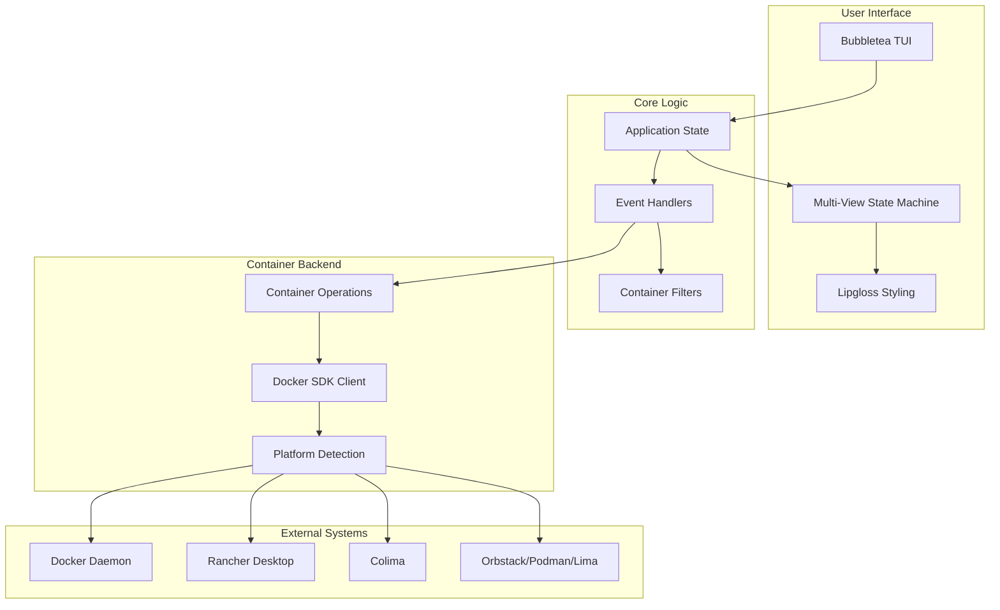
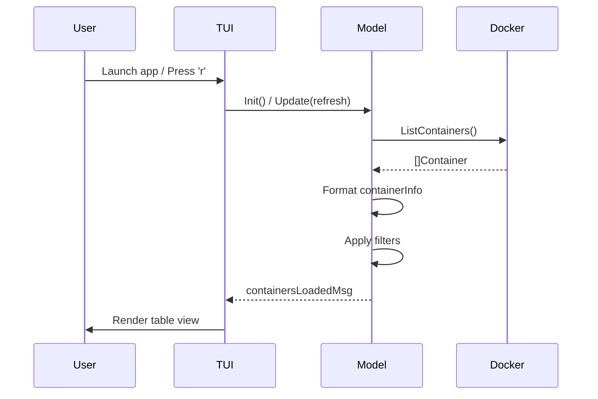
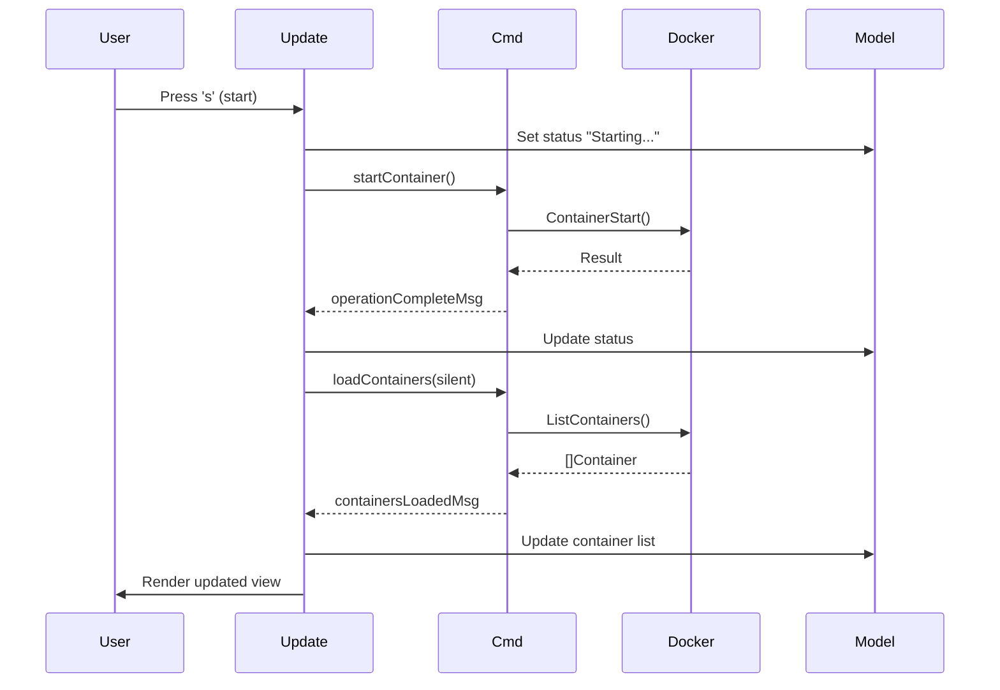
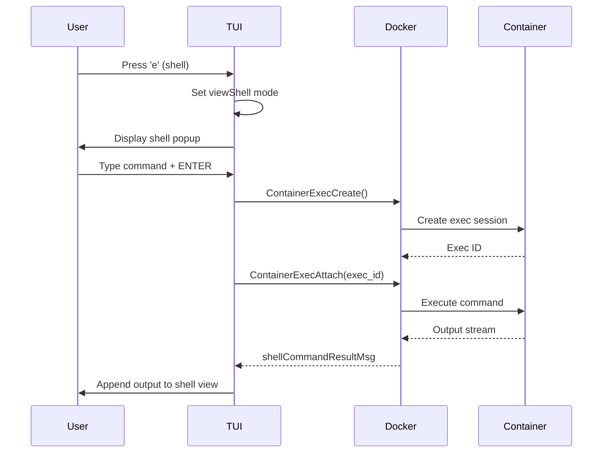
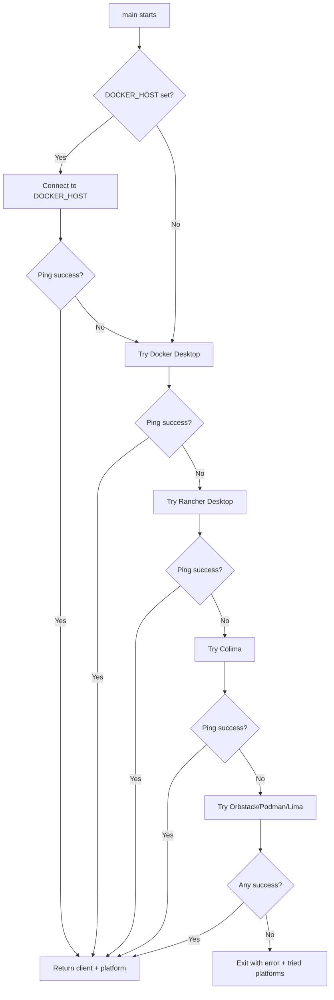
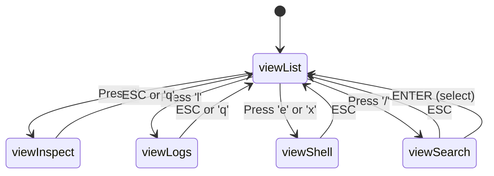

# LCM Codebase Map

> Auto-generated by Cartographer. Last mapped: January 15, 2026

## System Overview

LCM (Local Chrome Manager) is a Terminal User Interface (TUI) application built in Go for managing local Docker containers. It provides a modern, interactive way to view, control, and interact with containers across multiple container runtimes.

**Stack:** Go 1.25.5, Bubbletea TUI framework, Docker SDK, Lipgloss styling

**Architecture Pattern:** Message-driven TUI with async command execution and responsive layout



## Directory Structure

```
lcm/
├── main.go                # Core application (46KB)
├── main_test.go          # Unit tests (4KB)
├── go.mod                # Dependencies
├── go.sum                # Dependency checksums
├── Makefile              # Build automation
├── README.md             # Project documentation
├── lcm                   # Compiled binary
└── docs/
    └── CODEBASE_MAP.md   # This file
```

## File Guide

### Core Application Files

| File | Purpose | Key Content | Tokens |
|------|---------|-------------|--------|
| main.go | TUI app logic, views, container ops | Model type, Update/View/Init methods, Docker integration | ~10,000 |
| main_test.go | Unit tests | Platform detection, struct validation | ~800 |
| go.mod | Dependency management | Bubbletea, Lipgloss, Docker SDK | ~100 |
| Makefile | Build automation | build, test, install, lint targets | ~200 |
| README.md | Documentation | Features, usage, keyboard controls | ~1,000 |

## Module Guide

### Main Application (main.go)

**Purpose**: Complete TUI application for Docker container management

**Entry point**: `main()` function

**Key Types**:
- `Model` - Application state (containers, view mode, filters, selected index)
- `viewMode` - State machine enum (viewList, viewInspect, viewLogs, viewShell, viewSearch)
- `containerInfo` - Container display data
- `ContainerPlatform` - Runtime platform configuration
- `searchResult` - Fuzzy search results

**Key Functions**:

**Lifecycle & Initialization**:
- `main()` - Entry point, Docker connection, program launch
- `Init()` - Loads containers, starts auto-refresh ticker
- `initialModel()` - Creates default Model state

**Container Operations**:
- `loadContainers()` - Fetches from Docker API (main.go:250)
- `startContainer()` - Starts selected container (main.go:310)
- `stopContainer()` - Stops with timeout (main.go:330)
- `restartContainer()` - Restart operation (main.go:350)
- `inspectContainer()` - Gets JSON inspection data (main.go:390)
- `viewContainerLogs()` - Retrieves last 100 lines (main.go:430)
- `openBrowserForContainer()` - Opens port in browser (main.go:580)

**View Rendering**:
- `Update()` - Main event handler, all keyboard input (main.go:150)
- `View()` - View dispatcher based on mode (main.go:480)
- `viewListMode()` - Main container table (main.go:500)
- `viewInspectMode()` - JSON inspection view (main.go:650)
- `viewLogsMode()` - Log viewer (main.go:680)
- `viewShellMode()` - Interactive shell popup (main.go:710)
- `viewSearchMode()` - Fuzzy search popup (main.go:780)

**Platform Detection**:
- `tryConnectDocker()` - Multi-platform connection with fallback (main.go:80)
- `getContainerPlatforms()` - Returns priority-ordered platform list (main.go:100)

**Exports**: None (package main)

**Dependencies**:
- `github.com/charmbracelet/bubbletea` - TUI framework
- `github.com/charmbracelet/lipgloss` - Styling
- `github.com/docker/docker` - Docker client API

**Patterns**:
- Message-driven architecture (Bubbletea Cmd pattern)
- Functional command composition
- State machine for view navigation
- Filter pipeline (allContainers → filtered containers)
- Responsive column layout with dynamic sizing

**Configuration**:
- Environment: `DOCKER_HOST` (optional, highest priority)
- Defaults: Hide K8s containers, hide exited containers
- Auto-refresh: 1 second interval
- Container stop timeout: 10 seconds
- Log lines: Last 100

**Gotchas**:
- Docker Exec output is multiplexed (stdout/stderr combined)
- Shell uses `/bin/sh -c` for command execution
- Browser launch is OS-specific (darwin/linux/windows)
- Port parsing handles mapped and exposed formats
- Status messages auto-clear after delays
- Cursor resets if filtered list shrinks

---

### Tests (main_test.go)

**Purpose**: Unit tests for platform detection and data structures

**Key Tests**:
- `TestGetContainerPlatforms()` - Validates platform list
- `TestContainerPlatformSocketPaths()` - Socket path formatting
- `TestContainerPlatformHomePaths()` - HOME directory expansion
- `TestSearchResultTypes()` - Search result struct validation
- `TestContainerInfoFields()` - Container info struct validation
- `TestViewModeConstants()` - View mode enum uniqueness

**Dependencies**: Standard library (testing, os, strings)

**Patterns**: Table-driven tests with expected value maps

**Gotchas**: Tests skip if HOME environment variable not set

---

### Build Configuration (Makefile)

**Purpose**: Build automation and development workflow

**Targets**:
- `build` - Compile binary
- `run` - Execute with `go run`
- `test` - Run test suite
- `install` - Install to /usr/local/bin (or $PREFIX)
- `uninstall` - Remove from $PREFIX/bin
- `clean` - Remove build artifacts
- `fmt` - Format code
- `lint` - Run golangci-lint (requires external tool)
- `help` - Display target descriptions (default)

**Configuration**: `PREFIX` variable (default: /usr/local)

**Gotchas**:
- Install requires sudo for /usr/local
- Lint requires external golangci-lint installation

---

### Dependencies (go.mod)

**Purpose**: Go module definition and dependency management

**Direct Dependencies**:
- `github.com/charmbracelet/bubbletea v1.3.10` - TUI framework
- `github.com/charmbracelet/lipgloss v1.1.0` - Terminal styling
- `github.com/docker/docker v28.5.2+incompatible` - Docker API

**Transitive**: 54 packages (Docker ecosystem, OpenTelemetry, terminal utilities)

---

## Data Flow

### Container List Refresh



### Container Operation Flow



### Interactive Shell Flow



### Platform Detection Flow



## Architecture Patterns

### Message-Driven TUI (Bubbletea)

The application uses Bubbletea's Elm-inspired architecture:

1. **Model** - Application state (containers, view mode, selections)
2. **Update** - Message handler that transforms Model based on events
3. **View** - Pure function that renders Model to terminal
4. **Commands** - Async operations that return messages

**Key Messages**:
- `containersLoadedMsg` - Container list fetched
- `operationCompleteMsg` - Container operation result
- `shellCommandResultMsg` - Shell command output
- `containerCountMsg` - Helper for pluralization
- `tea.KeyMsg` - Keyboard input
- `time.Time` - Ticker for auto-refresh

### State Machine (View Modes)



### Filter Pipeline

```
Docker API (all containers)
    ↓
allContainers[] (unfiltered cache)
    ↓
filterContainers()
    ├─ hideK8s? → Remove k8s_* prefix
    └─ hideExited? → Remove "exited" state
    ↓
containers[] (displayed in UI)
```

### Responsive Layout Algorithm

1. Calculate fixed widths (cursor, ID, state)
2. Determine available width for variable columns
3. Distribute proportionally with minimums
4. Truncate with "..." if content exceeds allocation
5. Recalculate on terminal resize

## Platform Support

### Supported Container Runtimes

Priority-ordered auto-detection:

| Priority | Platform | Socket Path | Notes |
|----------|----------|-------------|-------|
| 1 | DOCKER_HOST | Environment variable | Highest priority |
| 2 | Docker Desktop | /var/run/docker.sock | Standard Docker |
| 3 | Rancher Desktop | ~/.rd/docker.sock, ~/.docker/run/docker.sock | Two possible paths |
| 4 | Colima | ~/.colima/default/docker.sock | macOS Docker alternative |
| 5 | Orbstack | ~/.orbstack/run/docker.sock | macOS Docker alternative |
| 6 | Podman | ~/.local/share/containers/podman/machine/podman.sock (macOS), /run/user/{uid}/podman/podman.sock (Linux) | Container alternative |
| 7 | Lima | ~/.lima/default/sock/docker.sock | Linux VM Docker |

### OS-Specific Behavior

**Browser Launch**:
- macOS: `open <url>`
- Linux: `xdg-open <url>`
- Windows: `rundll32 url.dll,FileProtocolHandler <url>`

**Socket Paths**:
- macOS/Linux: Unix sockets with home directory expansion
- Windows: Named pipes or TCP (via DOCKER_HOST)

## Keyboard Controls

### Main View (Container List)

| Key | Action | Description |
|-----|--------|-------------|
| ↑/k | Navigate up | Move cursor up |
| ↓/j | Navigate down | Move cursor down |
| s | Start | Start selected container |
| t | Stop | Stop selected container (10s timeout) |
| R | Restart | Restart selected container |
| i | Inspect | View JSON inspection data |
| l | Logs | View last 100 log lines |
| e/x | Shell | Open interactive shell popup |
| o | Browser | Open container port in browser |
| / | Search | Open fuzzy search popup |
| h | Toggle K8s | Show/hide Kubernetes containers |
| a | Toggle Exited | Show/hide exited containers |
| r/F5 | Refresh | Manually refresh container list |
| q/ESC | Quit | Exit application |
| Ctrl+C | Force quit | Immediate exit |

### Shell View

| Key | Action |
|-----|--------|
| Type | Enter shell command |
| ENTER | Execute command |
| ESC | Exit shell view |

### Search View

| Key | Action |
|-----|--------|
| Type | Filter containers/commands |
| ↑/↓ | Navigate results |
| ENTER | Select result |
| ESC | Exit search |

### Inspect/Logs View

| Key | Action |
|-----|--------|
| ↑/↓ | Scroll content |
| ESC/q | Return to list |

## Conventions

### Code Style

- Single-file architecture (main.go contains all logic)
- Bubbletea message-driven patterns
- Lipgloss styling composition
- Docker SDK client abstraction
- Functional command composition

### Naming

- `Model` - TUI application state
- `viewMode` - State machine enum
- `*Msg` suffix - Bubbletea message types
- `*Cmd` functions - Return tea.Cmd for async ops
- `view*Mode()` - View rendering functions

### Error Handling

- Docker errors displayed in status bar
- Platform detection failures show all tried platforms
- Shell command errors shown in output view
- Graceful degradation (no crash on API errors)

## Development Workflow

### Build & Run

```bash
# Development
make run              # Run without building
make build            # Build binary
make test             # Run tests
make fmt              # Format code
make lint             # Run linter (requires golangci-lint)

# Installation
make install          # Install to /usr/local/bin
make uninstall        # Remove from /usr/local/bin
PREFIX=/custom make install  # Custom install location

# Cleanup
make clean            # Remove build artifacts
```

### Testing

```bash
go test ./...         # Run all tests
go test -v ./...      # Verbose output
go test -cover ./...  # With coverage
```

### Dependencies

```bash
make deps             # Download and tidy dependencies
go mod tidy           # Tidy go.mod
go mod vendor         # Vendor dependencies
```

## Gotchas & Known Limitations

### Docker Exec Multiplexing

Shell command output is multiplexed (stdout/stderr combined). Production use would need proper demux handling:

```go
// Current: reads raw combined stream
// Proper: use docker/pkg/stdcopy.StdCopy() to demux
```

### Port Detection

Port parsing assumes standard Docker formats:
- Mapped: "8080:80/tcp" → opens http://localhost:8080
- Exposed only: "80/tcp" → tries http://localhost:80 (may not work)

No validation that port is actually accessible.

### Shell Command Execution

Uses `/bin/sh -c` which may not exist in all containers (Alpine uses `/bin/ash`). More robust: detect shell from container image or try fallbacks.

### Container Stop Timeout

Hard-coded 10 second timeout. Some containers may need longer graceful shutdown.

### Search Implementation

Simple substring matching - no fuzzy scoring algorithm. Performance degrades with 100+ containers.

### Auto-Refresh Frequency

1 second refresh can be intensive with many containers or slow Docker daemon. No adaptive refresh rate.

### No Pagination

Displays all containers in terminal viewport. With 100+ containers, scrolling becomes unwieldy. Would benefit from pagination or virtualized scrolling.

### Platform Detection Race

No parallel platform probing - tries each sequentially. Could be faster with concurrent connection attempts.

## Navigation Guide

### Add a new container operation

1. Add keyboard shortcut in `Update()` switch (main.go:150)
2. Create operation function (e.g., `pauseContainer()`) returning tea.Cmd
3. Call Docker SDK method in operation function
4. Return `operationCompleteMsg` with result
5. Handle message in `Update()` to update status
6. Optionally trigger `loadContainers(false)` for refresh
7. Update README keyboard controls

### Add a new view mode

1. Add constant to `viewMode` enum (main.go:20)
2. Create `view*Mode()` rendering function (main.go:700+)
3. Add case in `View()` dispatcher (main.go:480)
4. Add navigation logic in `Update()` (main.go:150)
5. Handle ESC key to return to viewList
6. Update README with navigation keys

### Add a new container platform

1. Add platform to `getContainerPlatforms()` (main.go:100)
2. Specify display name and socket path
3. Expand home directory if using ~
4. Platform will be auto-detected in priority order
5. Add to README supported platforms list
6. Add test case in `TestGetContainerPlatforms()`

### Modify table layout

1. Adjust column width constants (main.go:500)
2. Update distribution logic in `viewListMode()`
3. Modify truncation logic for overflow
4. Test with various terminal widths
5. Update responsive calculations

### Add filtering option

1. Add boolean field to `Model` (main.go:40)
2. Add keyboard shortcut in `Update()` switch
3. Add filter logic in `filterContainers()` (main.go:220)
4. Add toggle display in help text
5. Update status message on toggle
6. Document in README keyboard controls

---

**Generated by Cartographer** | [Learn more](https://github.com/kingbootoshi/cartographer)
